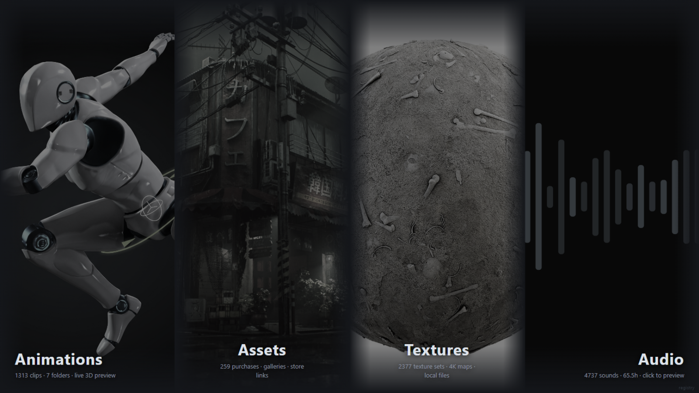
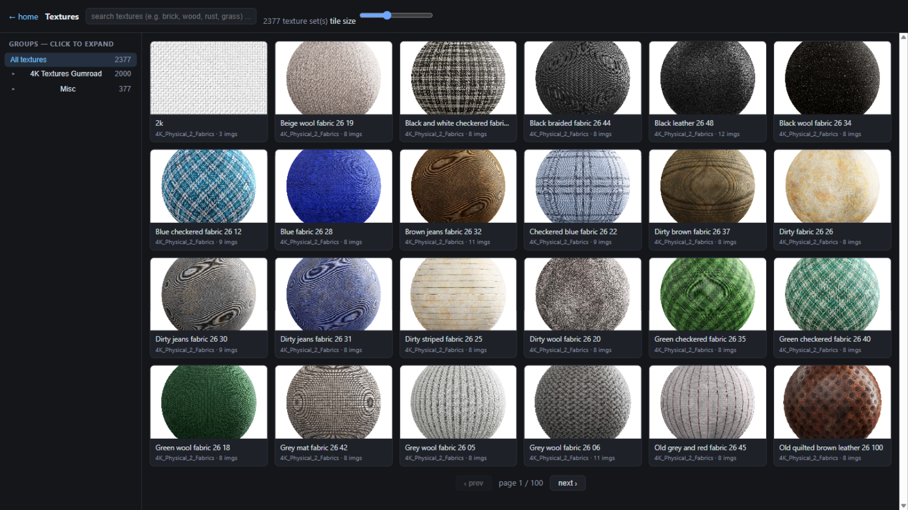
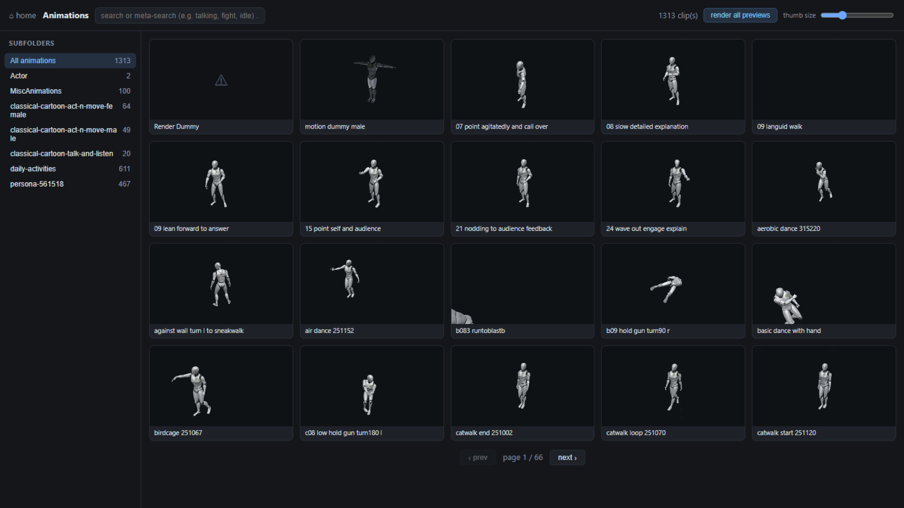
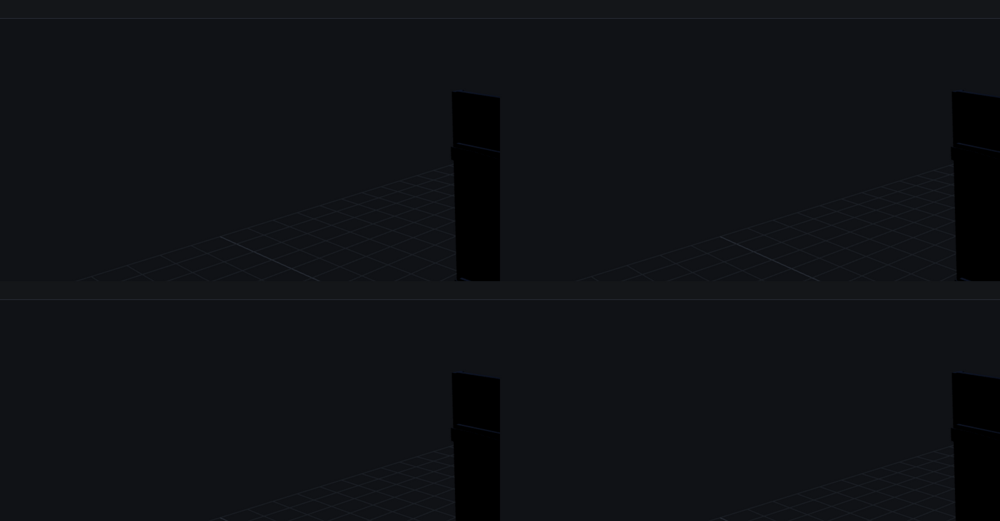

[](https://www.paypal.com/donate/?hosted_button_id=5XKG8WLLRWZ44)
[](https://www.patreon.com/NGallist)

# Pharos Library

A local asset-intelligence server for coding agents. Point it at a
folder of 3D assets, textures, audio, or animations. Pharos indexes
everything into a queryable SQLite registry and serves an HTTP API, a
dashboard, and MCP tools, so a coding agent can find, filter, and
select assets by real-world dimensions, materials, themes, and
availability — without walking the filesystem.

| Dashboard | Textures |
|---|---|
|  |  |
| **Animations** | **3D viewer** |
|  |  |

**You need**

- **A coding agent** that can run commands on your computer, for example Claude Code, Codex or Cursor.
- **Python 3.10 or newer** ([python.org](https://www.python.org/downloads/); on Windows tick "Add python.exe to PATH") and **Git** ([git-scm.com](https://git-scm.com/downloads)).
- **Optional:** Blender 5.x to build scenes and export Blender kits. Unreal Editor 5.x (Windows) only to pull models and material recipes out of Unreal packs.

**1. Set it up (one time).** Open your agent in any folder and paste this. Change the last line to your asset folder:

```
Clone https://github.com/MondRubberduck/PharosLibrary and set up Pharos
for my asset library. Setup only, no scenes yet.
Read README.md, then docs/STARTING_PROMPT.md, and follow it exactly.
My assets live at: D:\path\to\my\assets
```

**2. Answer its questions.** The agent scans your folder, then asks what only you can decide:

- Are there other asset folders, on other drives?
- Should it convert your Unreal packs? This is slow: roughly 1–30 minutes per pack.
- Should it export your Blender kits or list what is inside your .blend files?
- Do you have a purchase list (a CSV with Name, URL, Price)?

Not sure? Say **no**. Every step can be done later. Nothing slow starts without your yes.

**3. Wait for "setup complete".** The agent reports how many models, textures, sounds and animations it indexed, then stops.

**4. Build scenes whenever you like.** Replace both placeholders:

```
Build me a scene with my Pharos library: <your idea>.
Read <your asset folder>/_Agent_Files/AGENT_START_HERE.md first and
follow <the Pharos folder>/docs/AGENT_PLAYBOOK.md, phase 2.
```

**Next day, or after adding new assets?** Tell your agent to "run `python pharos.py ingest`, then start the Pharos server". The dashboard opens at http://127.0.0.1:8765.

**Your files stay untouched.** Pharos only reads your assets. Inside your library it writes just two kinds of things: its index folder `_Agent_Files`, and an `Exports` folder for Unreal or Blender conversions you approved.


## Why it pays off

Your coding agent gets **facts** in one short answer: real-world size, triangle count, material and texture maps, duration and ownership. Without Pharos it would have to walk the folders and open files, and most of these facts are in no readable file at all.

Measured on a real library of 81,063 files (12,280 models, 2,449 texture sets, 4,737 sounds, 1,313 animation clips). Tokens are roughly bytes ÷ 4.

| Your agent asks for… | Pharos answers with | Without Pharos, the agent has to… |
|---|---|---|
| a brick-wall texture set with all its maps | 10 matching sets, every map path: **~870 tokens** | find them in the folder tree. Even just the 727 file names containing "brick" are ~25,000 tokens. |
| a thunder or rain sound, 5–30 seconds | 10 sounds with durations: **~590 tokens** | read 194 candidate names (~3,900 tokens), then open each file to learn its length |
| wooden crates under 1.2 m | 10 crates with height, triangle count and material recipe: **~11,500 tokens** | open or parse every candidate model. Heights and triangle counts are written in no text file. |
| a street pole at least 4 m tall | 10 poles with the same facts: **~35,000 tokens** (big multi-material meshes) | the same, for 129 candidates |

For comparison, one plain listing of every file path in that library is about **2.4 million tokens**. Unreal packs can't be read at all without the Unreal Editor. Pharos converts them once, with your permission.

Setup on a fresh machine took about **40 minutes** on a 9 GB test library, with the agent asking its questions and converting one Unreal pack. Every change is tested on Windows, Linux and macOS, including a headless Blender build.

## Get started (no coding needed)

Your coding agent does all the technical work. You pick the folder, answer a few questions, and describe the scenes you want.


## What your agent does

**Setup** — driven by `docs/STARTING_PROMPT.md`, checked by
`docs/AGENT_SETUP_BRIEF.md`:

1. `pharos.py doctor` probes the machine and reports every gap with the
   exact command that fixes it.
2. `pharos.py init` detects your asset folders and writes
   `pharos_config.json`.
3. `pharos.py ingest` indexes everything that needs no engine, then
   asks you the decisions that are yours: crawl the Unreal packs for
   material recipes? export KitBash3D kits? enumerate .blend files or
   leave them alone? where is the purchase CSV?
4. Nothing with an engine runs without your answer. After your answers
   the server starts and prints INGESTION COMPLETE with per-section
   counts.

**Building** — `docs/AGENT_PLAYBOOK.md`, phase 2: query the API, author
a scene manifest, validate it, check the triangle budget, build
headless in Blender, reopen the .blend and verify the result. The
priority ladder: on disk → use it; owned but not downloaded → ask you;
absent → model it and say so.

## What works with and without engines

| Capability | Python only | + Blender | + Unreal Editor 5.x |
|---|---|---|---|
| Search: names, paths, tags, themes, availability | ✅ | ✅ | ✅ |
| FBX dimensions + triangle counts | ✅ | ✅ | ✅ |
| Texture sets, audio durations, purchase catalog | ✅ | ✅ | ✅ |
| OBJ/GLB/STL measured geometry | + trimesh | ✅ | ✅ |
| .blend / USD container enumeration | — | ✅ | ✅ |
| Kits → per-assembly FBX + manifests | — | ✅ | ✅ |
| Engine-exact material recipes | — | — | ✅ |
| Scene manifest → headless Blender build | — | ✅ | ✅ |

A section without content or without its engine serves empty results,
never errors.

## Requirements

- Python 3.10+. The core server is stdlib-only; the optional MCP
  integration adds one package (`pip install "mcp<2"`).
- Optional: Blender 5.x (scene building, Blender kit export, .blend
  enumeration), Unreal Editor 5.x on Windows with Git Bash (Unreal pack
  conversion).
- Windows, Linux and macOS are covered by CI.

## How it fits together

```
service/asset_service/    HTTP server, importers, MCP, scanner, doctor, ingest
                          (templates/ + static/ live inside it)
pipeline/                 optional conversion and index chains (UE, Blender)
tools/ tests/ docs/       PII gate, test suite, documentation
pharos.py                 CLI: init | doctor | ingest | serve | docs
```

The SQLite registry is derived data: importers rebuild it from crawler
outputs and disk on every start. Crawler-sourced tables rebuild
automatically; scanner-indexed rows return on the next
`pharos.py ingest`.
Asset files are never modified — the only writes into a library are
generated index files.

## Documentation

| For | Read |
|---|---|
| The paste-ready setup prompt | [docs/STARTING_PROMPT.md](docs/STARTING_PROMPT.md) |
| The agent's setup contract: decisions and interview | [docs/AGENT_SETUP_BRIEF.md](docs/AGENT_SETUP_BRIEF.md) |
| The two-phase doctrine and priority ladders | [docs/AGENT_PLAYBOOK.md](docs/AGENT_PLAYBOOK.md) |
| Every capability and limit, verifiable | [docs/CAPABILITIES.md](docs/CAPABILITIES.md) |
| MCP client configuration | [docs/MCP_SETUP.md](docs/MCP_SETUP.md) |

## License

### Support & Donations

If you find **Pharos Library** useful for your 3D workflow or pipeline, you can support ongoing maintenance and development:

* [](https://www.paypal.com/donate/?hosted_button_id=5XKG8WLLRWZ44) &nbsp; [Donate via PayPal](https://www.paypal.com/donate/?hosted_button_id=5XKG8WLLRWZ44)
* [](https://www.patreon.com/NGallist) &nbsp; [Support on Patreon](https://www.patreon.com/NGallist)

---

### License & Legal Notice

This project is open-source software licensed under the **BSD 3-Clause License**.  
All modifications and modernizations: Copyright (c) 2026 MondRubberduck and Contributors.  

MIT
